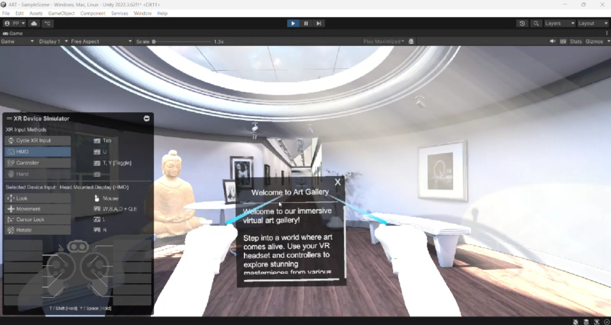

# 🎨 ART – Virtual Reality Art Gallery

An immersive **Virtual Reality (VR) Art Gallery** built with **Unity** and the **XR Interaction Toolkit**. ART enables users to explore a realistic virtual exhibition, interact with artworks using VR controllers, and experience an engaging museum-like environment.

> Developed as a collaborative Unity XR project for **Meta Quest 3**.

---

## 🎥 Demo

<p align="center">
  <a href="https://www.youtube.com/watch?v=ybLaSnqHRa4">
    
  </a>
</p>

<p align="center">
  <b>Click the image above to watch the demo on YouTube.</b>
</p>

---

## ✨ Features

- 🥽 Immersive VR gallery experience
- 🎮 Controller-based interaction using Meta Quest 3
- 🖼️ Interactive art exhibition
- 🚶 Smooth XR locomotion and navigation
- 📋 Interactive UI panels
- 🎨 Realistic 3D gallery environment
- ⚡ Real-time rendering with Unity

---

## 🛠️ Tech Stack

- Unity 2022
- C#
- Unity XR Interaction Toolkit
- OpenXR
- Unity Input System
- Meta Quest 3

---

## 📂 Project Structure

```text
ART
├── Assets/
├── Images/
│   └── demo-thumbnail.png
├── Packages/
├── ProjectSettings/
└── README.md
```

---

## 🚀 Getting Started

1. Clone the repository:

```bash
git clone https://github.com/prathamprabhu05/ART.git
```

2. Open the project in **Unity Hub**.
3. Allow Unity to import all required packages.
4. Open the main gallery scene.
5. Build and run the project on **Meta Quest 3**.

---

## 👥 Team

| Name | Role |
|------|------|
| **Pratham M Prabhu** | VR Development & Unity Programming |
| **Dhanush G Shetty** | VR Development & Unity Programming |

GitHub:
- https://github.com/prathamprabhu05
- https://github.com/DZ1shetty

---

## 🔮 Future Improvements

- 🤲 Hand Tracking Support
- 🎙️ Voice-Guided Art Tours
- 👥 Multiplayer Gallery Experience
- ℹ️ Interactive Artwork Information
- 🤖 AI-Powered Virtual Guide

---

## 📄 License

This project is intended for educational and portfolio purposes.

---

<p align="center">
Made with ❤️ using Unity & Meta Quest 3
</p>
